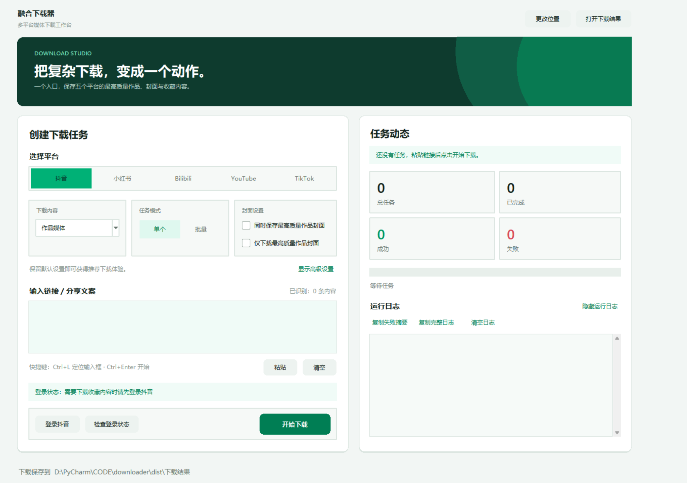

# 融合下载器

Windows 本地 GUI，整合抖音、小红书、Bilibili、YouTube、TikTok、微信和知乎下载能力。
## 界面展示




## 功能

- 抖音作品媒体：单条或批量下载作品视频、图集原图；图文作品会同时保存完整正文 Markdown，长文章内嵌图片会按实际像素选择最高质量并下载到 `assets/`。
- 抖音评论区图片：读取评论接口 `origin_url` 原图，保留评论用户和文本摘要。
- 抖音收藏夹：登录一次后刷新收藏夹列表，选择收藏夹批量下载其中作品。
- 小红书作品媒体：单条或批量下载图片、视频、Live Photo。
- 小红书评论区图片：复用小红书浏览器登录态读取评论图片并下载原图候选。
- 小红书收藏作品/专辑：登录后可下载“全部收藏作品”，也可像抖音收藏夹一样选择“专辑”批量下载；图片、视频、Live Photo 都会保存，已下载过的作品会自动跳过。
- Bilibili 视频媒体：支持单条或批量视频链接，选择当前访问权限下可用的最高质量视频流与最佳音频流，并通过 FFmpeg 无重编码合并；不下载弹幕、字幕、评论或收藏内容。
- YouTube 视频媒体：支持普通视频、短链接、Shorts 和直播回放链接；默认匿名下载公开最高画质，遇到验证时可按软件内教程导出 Cookie 并自动导入，再按当前账号权限选择最高视频与最佳音频，通过 FFmpeg 无重编码合并为 MKV。
- TikTok 视频媒体：首阶段支持公开单个作品链接，自动选择当前候选中分辨率、帧率和码率最高的视频并验证音频轨；暂不支持主页、收藏、评论、字幕、私密或必须登录的作品。
- 微信公众号文章与贴图：选择“微信”后可粘贴 `mp.weixin.qq.com` 公开文章、`pages/image_detail` 贴图链接及含链接的分享文案，软件会自动识别内容类型。文章与贴图保存为 UTF-8 Markdown；贴图只收集作品画廊图片，不混入头像、二维码和操作引导图。正文配图会实际下载、解码并按非预览/非水印、像素面积和有效字节数选择最高质量候选后写入同级 `assets/`。普通请求触发微信访问验证时会自动复用当前 Chrome/OpenCLI 会话。
- 微信视频号：支持 `weixin.qq.com/sph/...` 和对应的 `channels.weixin.qq.com/finder-preview/pages/sph?id=...` 分享链接。实现参考 [wx_channels_download](https://github.com/ltaoo/wx_channels_download) 的公开分享解析与“原始视频”规则，通过其公开解析服务取得短期媒体地址，再只保留 `encfilekey` 与 `token` 请求原始质量；原始地址不可用时才在 H.264/H.265 在线候选中回退。下载前核验媒体响应，完成后使用 FFprobe 确认视频轨、音频轨、分辨率、帧率和编码；不会安装根证书、启动 MITM 代理或修改系统代理。该入口依赖第三方公开解析服务，服务不可用时会明确报错。
- 知乎回答/专栏：支持 `/question/.../answer/...` 回答链接和 `zhuanlan.zhihu.com/p/...` 专栏链接，只提取目标回答或目标文章正文；普通请求受限时会依次复用当前 Chrome/OpenCLI 会话和软件专属知乎登录态。
- 可选最高质量作品封面：勾选 `同时保存最高质量作品封面` 会在原任务之外额外保存封面；勾选 `仅下载最高质量作品封面` 则只解析和保存封面，不传输视频、图片媒体或评论内容。两种模式覆盖抖音、小红书、Bilibili、YouTube、TikTok 五个媒体平台的单个、批量与收藏入口，并按实际解码像素、非预览/非水印和有效字节数择优，而不是只相信 URL 名称或声明尺寸。微信使用自动识别模式、知乎使用文章模式，两者不显示封面选项。
- 自动检测 IDM：有 IDM 时用于适合的大文件下载；没有时使用内置并发下载器。

## 使用

开发环境双击：

```text
启动融合下载器.bat
```

或运行：

```powershell
.\.venv\Scripts\python.exe app.py
```

默认输出目录位于软件同级，所有下载产物直接放在这一层：

```text
下载结果/
```

界面底部集中显示当前下载根目录，并提供“更改位置”和“打开下载结果”。程序会在所选位置自动创建 `下载结果/`，并记住该选择。

默认保存方式是“按博主分类”：程序在 `下载结果/` 下按解析到的作者名称创建文件夹，同一博主后续下载的作品、封面、评论图片和图文 Markdown 都会继续进入该文件夹。作者名会经过 Windows 文件夹安全化处理。也可以在界面底部切换为“全部放在下载结果”，保持旧版的平铺结构；保存方式会被记住。

文件名会包含平台、作者、标题、作品/笔记 ID 和序号，避免批量下载时覆盖。抖音图文正文使用 `_正文.md` 后缀，包含作者、作品 ID、原始链接、可用的发布时间和完整分段正文；长文章图片保存到该 Markdown 所在作者文件夹的 `assets/`，正文使用 Typora/Obsidian 兼容的 `./assets/...` 相对路径。每张图会实际下载并解码多个候选，按像素面积和有效字节数选择最高项，不再引用容易发糊的文章预览图。重复运行会复用内容相同的 Markdown 和图片，已有旧 Markdown 但缺少本地图片时会自动补齐。可选封面使用 `_封面_宽x高` 后缀；同一作品已有可解码封面时会复用，不重复生成 `_2`、`_3` 副本。

微信公众号文章、微信贴图和知乎同样使用 `_正文.md` 与同级 `assets/`。微信视频号使用 `微信视频号_作者_标题_内容ID.mp4`。默认按公众号名、视频号作者名或知乎作者名建立文件夹；切换为“全部平铺”后产物直接写入 `下载结果/`。正文中的图片引用统一使用 `./assets/...`，可以直接在 Typora 或 Obsidian 中打开。重复下载相同内容会复用已经验证的 Markdown、本地图片或视频。

封面下载失败会作为独立警告显示，不会把已经成功并验证的媒体产物误报为失败；日志会保留具体平台和错误原因。封面 CDN 请求只携带普通图片请求头和必要的 `Referer`，不会把账号 Cookie 转发到媒体 CDN。

首次使用抖音收藏夹或需要登录态的评论区功能时，点击 `登录抖音` 扫码登录一次；之后软件会复用 `抖音浏览器登录态/`。小红书可点击 `登录小红书` 打开专属登录窗口，之后软件会复用 `小红书浏览器登录态/`；公开笔记媒体通常不强制登录，评论区图片、收藏作品和专辑更依赖登录态。

微信公众号公开文章通常无需登录；贴图页可能触发微信访问验证，此时软件会复用当前正常 Chrome/OpenCLI 会话读取页面，临时窗口在任务结束后自动关闭。视频号分享链接会发送给第三方公开解析服务 `sph.litao.workers.dev`，但不会发送 Cookie、微信登录状态或浏览器数据；返回的短期签名媒体 URL 只用于本次下载，不写入日志或配置。知乎同样会先尝试公开页面，再尝试复用当前 Chrome；如果仍失败，可在选择“知乎”后点击 `登录知乎`，在打开的专属窗口完成登录，再重新下载。这个人工登录窗口会保留，需由用户主动关闭。知乎登录状态只保存在软件同级且已忽略的 `知乎浏览器登录态/`，不会提交到仓库；站点继续返回“请求存在异常”时，软件会明确报错，不会把错误页或其他回答保存成正文。

Bilibili 高画质通常使用分离的 DASH 视频和音频流，因此运行环境必须能找到 `ffmpeg` 和 `ffprobe`。打包脚本会在构建时自动捆绑本机可用版本。未登录时会下载公开可用的最高质量；如需账号或大会员专属的 4K/高帧率清晰度，请点击 `登录 Bilibili`，在独立窗口登录后软件会复用 `Bilibili浏览器登录态/`。程序不会写死 1080p，而是从当前账号实际可用格式中按分辨率、帧率、码率依次选择最高项。媒体流使用 4 MiB 有界并行 Range 下载，“稳定/均衡/快速”分别最多使用 2/4/8 路连接；每块都会验证范围和长度，节点异常时自动轮换备用 CDN，并行不兼容时回退串行稳定下载。

YouTube 依赖 `yt-dlp-ejs` 和 Deno 处理站点 JavaScript 挑战，正式 EXE 会把它们与 FFmpeg/FFprobe 一起内置，用户无需额外安装。程序按分辨率、帧率、码率选择当前权限内最高项；普通 HTTP 媒体流使用有界并行 Range 下载，“稳定/均衡/快速”分别对应 2/4/8 路连接，失败时自动回退到 yt-dlp 稳定分段。

YouTube 默认使用匿名模式。遇到机器人验证或需要账号权限的内容时，可点击 `YouTube 登录设置`：

- `打开 Cookie 导出教程（推荐）`：软件会逐步说明如何安装官方推荐的 [Get cookies.txt LOCALLY](https://chromewebstore.google.com/detail/get-cookiestxt-locally/cclelndahbckbenkjhflpdbgdldlbecc)、允许无痕模式、登录 YouTube、在同一标签页打开 `robots.txt`，并以 Netscape 格式点击 `Export`。教程同时提供 [yt-dlp 官方 YouTube Cookie 说明](https://github.com/yt-dlp/yt-dlp/wiki/Extractors#exporting-youtube-cookies)。
- `自动查找并导入刚导出的 Cookie`：只检查当前用户桌面和下载目录顶层中最近 48 小时的 `.txt` 文件；自动跳过空文件、非 Netscape 文件、其他网站 Cookie 和没有账号凭据的游客 Cookie，选择最新有效文件。
- `手动选择 cookies.txt`：自动查找不到时使用；程序只复制并保存 `youtube.com` 和 `google.com` 相关条目，不保存其他站点 Cookie。
- `使用 Firefox / 读取现有 Chrome/Edge`：保留在高级方式中。Firefox 可读取正常浏览器登录状态；Chrome/Edge 直接读取受 Windows 应用绑定加密和数据库锁定影响，属于实验能力，可能失败。
- `清除并使用匿名模式`：删除软件本地 `YouTube登录态/` 中的 Cookie 与配置。

Windows 新版 Chrome/Edge 的 Cookie 存在应用绑定加密和数据库锁定，因此软件不会强制关闭浏览器、绕过系统加密或要求管理员权限。扩展名称必须包含 `LOCALLY`；不要安装名称相似的旧扩展。Cookie 相当于临时登录钥匙，请勿分享、上传或提交到仓库。登录状态不能保证解除已经发生的 HTTP 429 IP 限流，遇到该提示应停止重复请求、关闭代理/VPN、等待或切换网络。账号下载存在触发限流或封禁的风险，非必要时优先匿名下载；私享、会员、年龄验证和地区限制仍受 YouTube 与账号权限约束。

TikTok 当前只支持公开单个作品链接。程序使用内置 yt-dlp 选择 `res → fps → br` 排序最高的候选，优先使用站点返回的非 `watermarked` 高质量流，并通过 FFprobe 验证最终文件同时包含视频和音频。正式 EXE 已内置解析器、`curl-cffi` 浏览器请求模拟支持与 FFmpeg/FFprobe，目标电脑无需安装 Python 或 yt-dlp。

## 打包

```powershell
.\build_exe.bat
```

生成：

```text
dist\融合下载器.exe
```

## 目录

- `app.py`：统一 GUI。
- `downloaders/douyin.py`：抖音作品和评论区下载核心。
- `downloaders/xiaohongshu.py`：小红书下载核心。
- `downloaders/bilibili.py`：Bilibili 最高质量视频下载、合并和媒体验证。
- `downloaders/youtube.py`：YouTube 匿名/可选登录态、最高质量下载、Deno/EJS 解析、错误分级、合并和媒体验证。
- `downloaders/tiktok.py`：TikTok 公开单作品最高质量视频下载和媒体验证。
- `downloaders/article_common.py`：网页文章正文清洗、Markdown 转换、高清图片本地化和重复复用。
- `downloaders/wechat.py`：微信公众号文章、微信贴图文字与最高质量原图解析和下载。
- `downloaders/wechat_channels.py`：微信视频号分享链接解析、原始质量选择、下载与音视频验证。
- `downloaders/zhihu.py`：知乎回答/专栏精确提取、Chrome 会话与专属登录态兜底。
- `downloaders/covers.py`：跨平台封面候选验证、实际像素择优、重复检测和安全保存。
- `downloaders/douyin_collection.py`：抖音收藏夹列表和批量下载适配。
- `services/task_runner.py`：统一任务调度。
